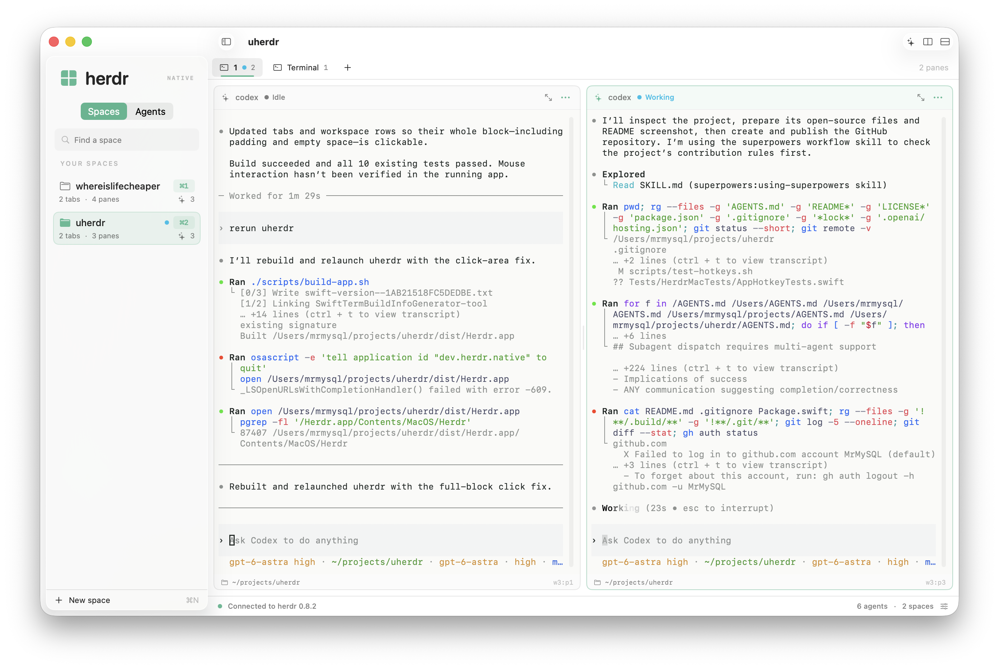

# Herdr for macOS

A native SwiftUI + AppKit client for the herdr runtime. Spaces map to herdr workspaces; each space has tabs with nested, resizable terminal panes. The Agents view shows detected agents and their status.



## Requirements

- macOS 14 or newer.
- Swift command-line tools (Swift 6.0 or newer) to build.
- herdr 0.8.2 or newer with `herdr terminal session control` support.

## Build and run

```sh
git clone https://github.com/MrMySQL/uherdr.git
cd uherdr
./scripts/build-app.sh
open dist/Herdr.app
```

Open `Package.swift` in Xcode to develop the app, or use `swift build` and `swift run HerdrCoreTests` from a terminal. Swift Package Manager downloads GhosttyTerminal's checksummed native XCFramework and MSDisplayLink on the first build. The pinned Swift wrapper is vendored in this repository.

The sidebar groups spaces and agents by device. **This Mac** uses your default local herdr socket and preserves existing connection preferences. Use the menu beside a device to edit its socket and local herdr executable. Start herdr first, or use the local device's Start Server button. Quit detaches the client; shells and agents remain owned by herdr.

## Connect another device over SSH

1. On the other Mac, enable Remote Login and start herdr. Install a compatible herdr CLI on this Mac too; the app uses it to control terminals through the tunnel.
2. Configure SSH key authentication and connect once from Terminal (for example, `ssh alex@mac-mini.local`) to verify the host key. Existing SSH aliases, keys, agents, ports, and jump hosts in `~/.ssh/config` are supported. Password-only authentication and interactive passphrase prompts are not supported in the app; unlock encrypted keys in your SSH agent first.
3. Click **Add device…** in the sidebar. Enter a name and SSH host, such as `alex@mac-mini.local` or an SSH-config alias. Username, port, and identity file are optional overrides.
4. Leave **Remote socket** empty to discover the remote default socket. For a named session, enter `~/.config/herdr/sessions/<name>/herdr.sock`. The executable field always refers to the herdr CLI on this Mac.
5. Click **Save and connect**. All devices stay visible together. Click a space to work on its device; each device remembers its selection. When creating a remote space, enter an absolute folder path on that device.

Each remote device has its own SSH connection forwarding two private Unix sockets: the workspace API socket and herdr's companion `-client.sock` terminal socket, using [OpenSSH local socket forwarding](https://man.openbsd.org/ssh.1#L). Host verification stays enabled. The remote SSH server must allow Unix-socket forwarding (`AllowStreamLocalForwarding`). No herdr TCP listener is required.

Connection errors appear under the affected device and in its detail view. Failed remote connections retry every ten seconds. Use the device menu to reconnect immediately, disconnect, edit, or remove a saved connection. Disconnecting or removing a device leaves its remote workspaces and processes running. Start/stop of remote herdr servers is managed on the remote device.

## Interaction

- Sidebar: switch between Spaces and Agents, grouped by device; select a space or jump to an agent. Command-1 through Command-9 select the first nine spaces across devices in sidebar order. Hold Command to reveal shortcut badges on the space cards. Search filtering and collapsing devices do not renumber shortcuts. Command-Shift-R renames the current space.
- Tabs: create with Command-T and rename the current tab with Command-R. Control-1 through Control-9 select the first nine tabs in the current space. Control-Tab selects the next tab, and Control-Shift-Tab selects the previous tab, wrapping at either end. Command-Shift-] and Command-Shift-[ also cycle tabs. Rename and close from the context menu.
- Panes: Command-D splits side by side; Command-Shift-D stacks panes; Command-Return toggles zoom for the focused pane. Drag the divider to resize. Use the pane header to focus, zoom, rename, start an agent, or close.
- Start an agent: creates a Git worktree from the pane’s repository, opens it in a new space, and launches the selected agent there. Herdr generates the branch name. The selected agent CLI must be installed. If launching fails, the new space stays available for retrying in its terminal.
- Terminal: normal keyboard input, Shift-Enter for a new line in Claude Code and Codex, native text selection, Command-C/Command-V, and mouse-wheel scrolling.
- Links: click a web URL or labeled hyperlink in terminal output to open it in your default browser. Command-click also works; dragging selects text, and applications that capture the mouse keep their normal clicks.
- File drops: drag one or more files from Finder onto an agent’s terminal pane to paste their quoted paths. The target pane gains keyboard focus; press Enter when your prompt is ready.
- Command-N creates a space. Command-comma opens Settings.

Closing a pane, tab, or space terminates its processes and therefore asks for confirmation. Terminal ownership conflicts are shown on the affected pane; Take Control explicitly replaces the previous writable controller.

## Architecture

`HerdrCore` contains Codable protocol/device models, bounded JSON line parsing, Unix socket requests, and managed SSH processes. `HerdrMac` contains the SwiftUI shell, a device store with one independent session store per device, and the GhosttyTerminal AppKit bridge. Each visible terminal uses the local `herdr terminal session control` with JSON messages on standard input and base64 ANSI frames on standard output. Each remote device forwards both its API socket and the companion terminal socket over its SSH connection. Ghostty's host-managed in-memory backend renders these frames and encodes keyboard/mouse input; Herdr owns the shell and scrollback. The CLI handles herdr's binary protocol negotiation. Shells are never spawned as substitutes for server panes.

GhosttyTerminal is the sole terminal backend in this prototype. The Swift wrapper is vendored from `1.5.20260906` with a small addition exposing the native replay API; see [vendor provenance and patch notes](Vendor/GhosttyTerminal/README.md). The community binary carries host-managed I/O patches over Ghostty. Native font/theme changes update the existing surface. Terminal-query replies generated while rendering server frames are suppressed at their source, because Herdr handles those queries upstream. Mouse-wheel events continue to use Herdr's scroll protocol.

Connection state is refreshed from authoritative snapshots. UI actions use explicit server resource IDs. Window geometry and connection/appearance preferences are persisted locally.

## Distribution

The build script creates an ad-hoc-signed app for local use. Distribution to other Macs requires your own Developer ID signing and notarization. The herdr runtime is installed separately.

## Dependencies

[GhosttyTerminal / libghostty-spm](https://github.com/Lakr233/libghostty-spm) supplies the Swift/AppKit integration around [Ghostty](https://github.com/ghostty-org/ghostty), with [MSDisplayLink](https://github.com/Lakr233/MSDisplayLink) for display scheduling. These dependencies are MIT licensed; their notices are included in the built app. [Herdr](https://github.com/herdrdev/herdr) supplies the runtime and terminal/control protocols.

## Verification

```sh
swift run HerdrCoreTests  # Protocol, layout, selection, and error handling
./scripts/test-hotkeys.sh # Command-key hint lifecycle
bash scripts/test-agent-worktree.sh # Worktree agent launch and failure handling
bash scripts/test-terminal-keyboard.sh # Real Ghostty rendering, keyboard, paste, resize, and teardown
./scripts/test.sh         # Also starts and cleans up an isolated herdr server
bash scripts/test-devices.sh # Two isolated servers, overlapping IDs, and forwarded terminal control
```

The standalone Swift test runner works with Command Line Tools; XCTest is not required. Live tests cover workspace/tab/pane lifecycle, nested right/down splits, divider ratios, shell input/output, agent status fixtures, terminal ANSI streaming, resize, scrolling, and detach preservation. They accept only an explicitly disposable socket under `/tmp`.

Topology and agent status refresh independently per device every 1.25 seconds and after actions; terminal output streams continuously. Only visible terminals acquire writable controllers. Switching devices releases the previous terminal controllers without stopping their shells. The multi-device tests use a controlled SSH stand-in with real Unix-stream forwarding, not a physical remote Mac. Kitty graphics overlays are not included in this version.

## Contributing

Issues and pull requests are welcome. Include your macOS, Swift, and herdr versions when reporting a bug, along with steps to reproduce it. For code changes, run the verification commands above and describe any manual UI checks in your pull request.

## License

[MIT](LICENSE). Third-party dependencies retain their own licenses.
