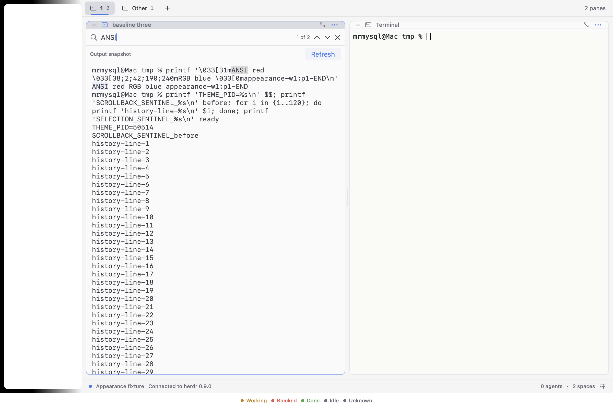
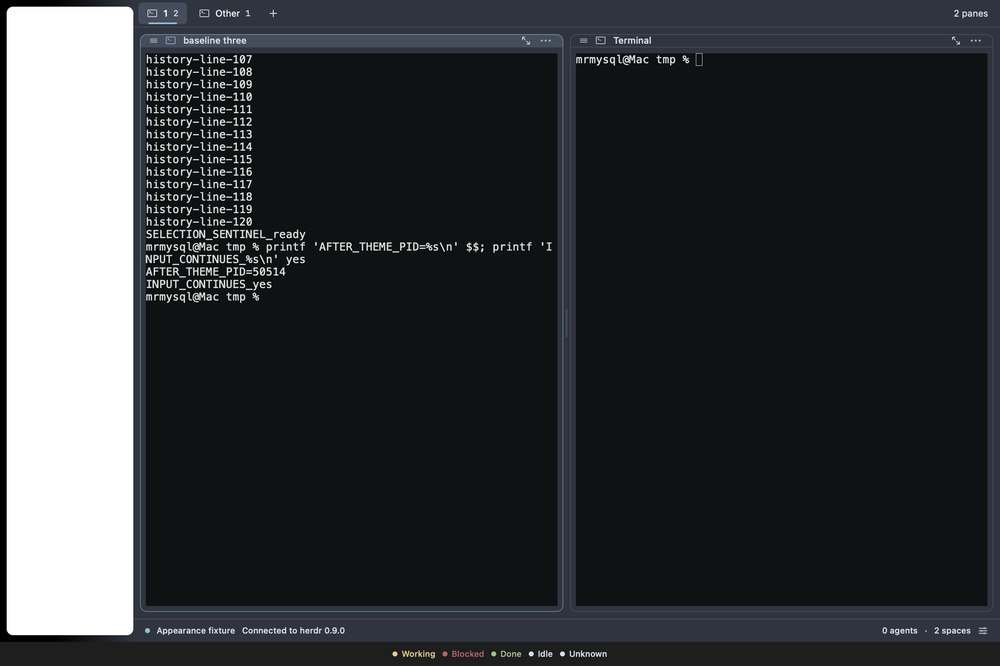
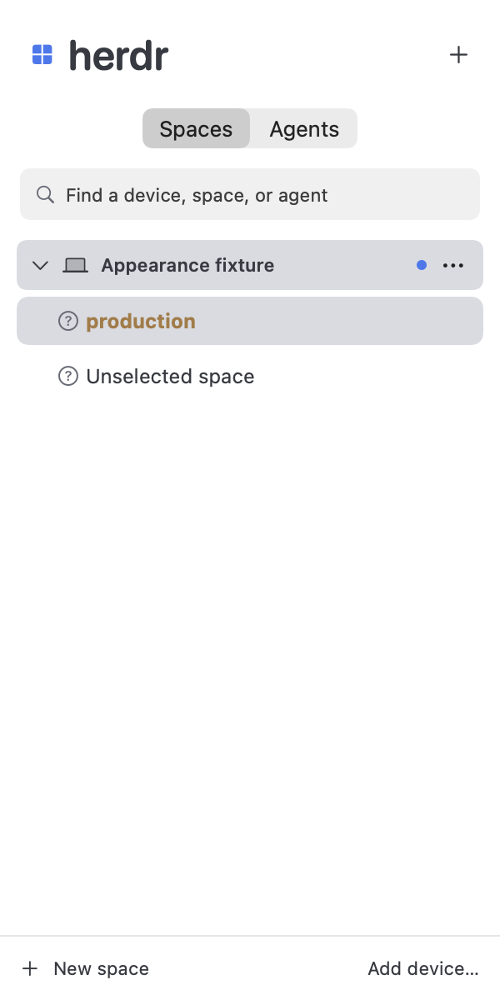
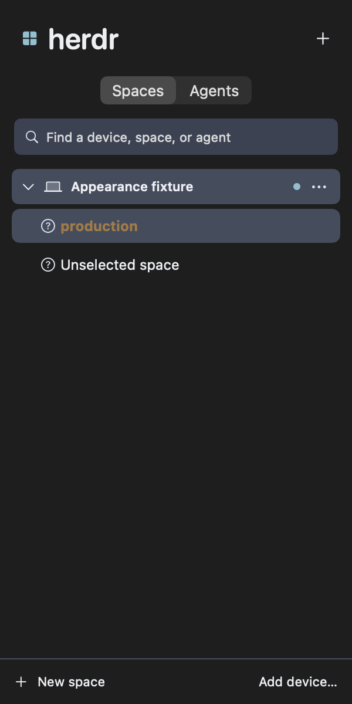

# Appearance

Open **Settings → Appearance** with Command-comma. System follows macOS; Light and Dark force that mode. The initial **uherdr** preset preserves the previous native colors and existing terminal palettes. Appearance and terminal font size are shared by all connected devices and saved only on this Mac. Existing appearance/font preferences migrate once.

Choose one Theme or separate Light theme and Dark theme presets. A mixed pair displays **Custom (mixed)**. Choosing a native preset switches Theme source to Native. The catalog includes 17 concrete upstream presets plus uherdr; names, exact revision, sibling families and licenses are in [theme provenance](theme-provenance.md).

UI color overrides have Common, Light and Dark sections. Reset an individual color with its undo button, or reset the displayed section. Changes preview immediately. Advisory warnings identify foreground/background pairs below 4.5:1, including custom sidebar foregrounds and dimmed text. They never rewrite your colors or upstream palettes. Native material/reset backgrounds use system-color estimates, so the warning is not a guarantee of contrast in every window state. Inspect both modes when choosing a fixed sidebar color.

## Importing a Herdr config

Select **Herdr config**, choose a local TOML file, and use **Reload** after editing it. The chooser starts at `~/.config/herdr/config.toml`. uherdr reads the file at startup and on explicit reload; there is no automatic watcher. It never writes the file, changes a remote machine, or synchronizes preferences across machines.

Malformed supported sections retain the last good appearance atomically and display a path/key diagnostic. The last good snapshot is saved for offline startup. Unknown theme/sidebar keys are reported; unrelated config sections are ignored. Regular files up to 1 MiB are supported.

This [tested example](appearance-example.toml) selects One Light and Nord and makes workspace names containing `prod` bold and ochre:

```toml
[theme]
name = "one-dark"
auto_switch = true
light_name = "one-light"
dark_name = "nord"

[theme.custom.light]
accent = "#286b45"

[ui.sidebar.spaces]
rows = [["state_icon", { token = "workspace", rules = [{ contains = "prod", fg = "#a87a40", bold = true }] }]]
```

The example color is intentionally fixed across modes; preview warnings can flag it against selected or unselected backgrounds. Change it to suit your chosen palette. Imported auto-switching uses the macOS mode, or the forced Light/Dark setting. With `auto_switch = false`, the exact imported theme stays fixed.

Colors resolve in this order:

1. The selected built-in preset for the effective mode.
2. Imported common overrides.
3. Imported light/dark overrides when auto-switching is enabled.
4. Native common overrides, then native active-mode overrides.

Supported override keys are `accent`, `panel_bg`, `sidebar_bg`, `active_row_bg`, `selection_bg`, `surface0`, `surface1`, `surface_dim`, `overlay0`, `overlay1`, `text`, `subtext0`, `mauve`, `green`, `yellow`, `red`, `blue`, `teal`, and `peach`. Mode tables accept the same keys. Reset/default/transparent values restore the selected base palette's value for that role. Native role fallback applies only when the base role is itself reset; reset never makes text invisible.

## Sidebar rows and rules

The sidebar editor supports workspace and agent rows, per-agent replacement layouts, row/token/rule ordering, fixed foreground color, bold/dim, and a sample preview. Imported layouts are read-only; **Copy to native preset** copies the complete layout and rules, including per-agent overrides, and switches to Native. **Save native sidebar** validates and applies edits. **Use default** restores the native layout, or the common agent layout for a per-agent override.

Rules match full token values before truncation. The first matching `equals`, `contains`, `starts_with`, `gt`, or `lt` rule patches the occurrence's base style. Text matching is byte-exact unless ASCII ignore-case is enabled; numeric comparisons require finite decimal values and do not accept ignore-case. Inherit, On, and Off preserve omission versus explicit false for bold, dim and hide. Missing/empty values and hidden occurrences disappear. Empty rows disappear too. There are at most 16 rows, token occurrences per row, and rules per occurrence; row gap accepts 0–65535. Per-agent layouts replace the common rows completely.

Styles affect the configured token text, leaving separators and row backgrounds separate. State icons, status labels, selected folder icons, tab indicators, pane borders, and accessibility selection labels retain non-color cues.

Each device resolves its own snapshot metadata. Herdr 0.9.0 remains supported. Optional `$metadata` and title fields appear only when supplied by the server; unavailable fields disappear without extra polling. Branch/Git status is unavailable in the public snapshot and omitted. Tab labels use the available public label. Agent pane text falls back from agent title to pane label, then legacy pane title. See [fixture provenance](../Tests/Fixtures/sidebar-snapshot-provenance.md) for the distinction between live 0.9 evidence and newer schema-derived tests.

## Native and terminal boundaries

Global UI themes cover the sidebar, tabs, pane headers/borders, search and status indicators. Upstream active-row coloring maps to the selected workspace or focused agent; navigate selection maps to native keyboard focus. There is no additional navigation mode.

The imported `terminal` theme reads the embedded terminal's existing ANSI palette as its UI color source. There is no outer host terminal. UI presets and overrides do not set terminal background/foreground, ANSI colors, or RGB output. Light/dark mode and font size retain the existing Ghostty update path. Running shells, writable controllers, selection and scrollback survive theme changes. Hidden retained tabs receive current appearance before reveal without continuously publishing hidden roots.

Individual workspace/tab/pane color assignments, color inheritance, per-pane backgrounds, and new terminal-palette or “Match app theme” controls are outside scope.

## Native rendering examples

These are actual AppKit view-cache renders of production components, not desktop screenshots. The main window cache omits the material sidebar, so a separate production sidebar render accompanies each mode. The conditional examples use the rule above in a disposable shell workspace; status badges are previews, with no agent processes started.

| One Light | Nord dark |
| --- | --- |
|  |  |
|  |  |

[Verification evidence and limitations](verification.md#coloring-acceptance--2026-09-16) include the default-theme baseline, catalog inspection, native Increase Contrast appearances, terminal continuity, and release checks.
